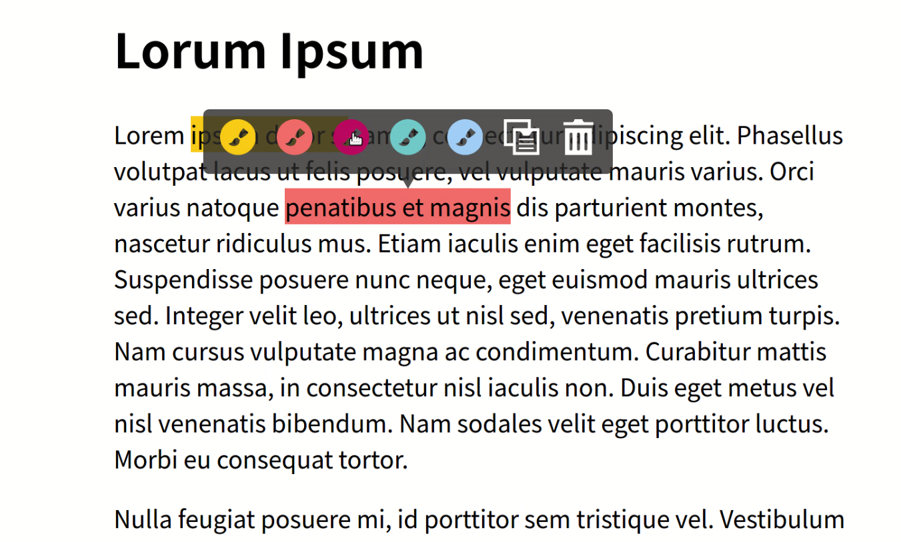

It's intended to be a js add-on helping mark key contents when reading through webpages.  

## Added new features:  

- highlighting text  
- changing highlight color  
- copying to clipboard
- ...  


## Issues remains to be fixed:  

- highlighting text across tags  


***   
## the original repo:


# TinyQ
A zero dependency JS plugin which allows readers to highlight text within a web page and task some action. By default the plugin will allow the user to create a tweet, or a Facebook post.

## [Demo](https://aruminant.github.io/tinyq/)

## Quickstart

```html
<script src="tinyquoter.min.js"></script>
<script>
    document.addEventListener("DOMContentLoaded", function(event) {
        window.TinyQ.init();
    });
</script>
```

  
